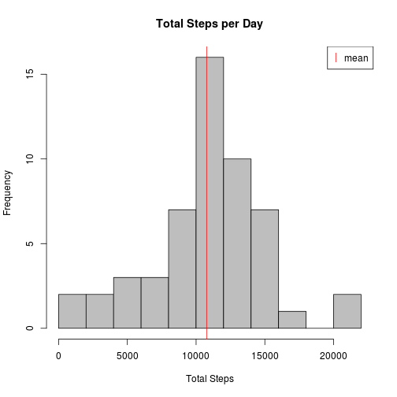
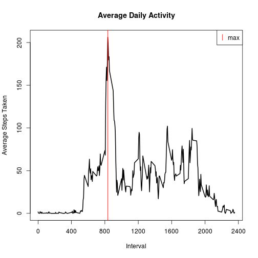
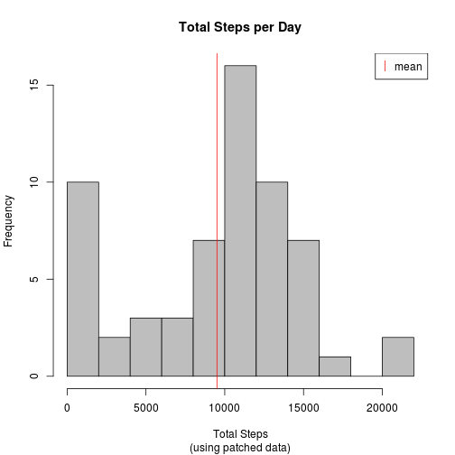
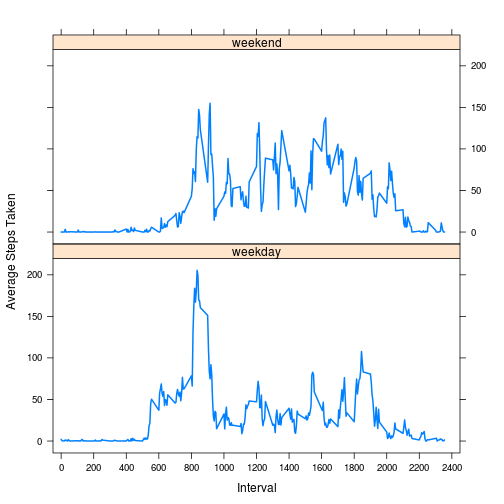

## Loading and preprocessing the data

The raw data was provided as a zip archive, so first we clear the local data
directory and unzip it:


```r
unlink("data", recursive = TRUE, force = TRUE)
unzip("activity.zip", exdir = "data")
dir("data")
```

```
## [1] "activity.csv"
```

The zip file contained a csv file with data, so we load it:


```r
DF <- read.csv("data/activity.csv")
str(DF)
```

```
## 'data.frame':	17568 obs. of  3 variables:
##  $ steps   : int  NA NA NA NA NA NA NA NA NA NA ...
##  $ date    : Factor w/ 61 levels "2012-10-01","2012-10-02",..: 1 1 1 1 1 1 1 1 1 1 ...
##  $ interval: int  0 5 10 15 20 25 30 35 40 45 ...
```

The date field needs to be converted and the interval treated as an ordered factor:


```r
DF$date <- as.Date(DF$date)
DF$interval <- as.ordered(DF$interval)
str(DF)
```

```
## 'data.frame':	17568 obs. of  3 variables:
##  $ steps   : int  NA NA NA NA NA NA NA NA NA NA ...
##  $ date    : Date, format: "2012-10-01" "2012-10-01" ...
##  $ interval: Ord.factor w/ 288 levels "0"<"5"<"10"<"15"<..: 1 2 3 4 5 6 7 8 9 10 ...
```

Now the data looks good.

## What is mean total number of steps taken per day?

First, we remove the data that is NA, then sum the steps taken grouped by date:


```r
DFcomplete <-DF[complete.cases(DF), ]
stepsPerDay <- with(DFcomplete, tapply(steps, date, sum))
meanStepsPerDay <- mean(stepsPerDay)
medianStepsPerDay <- median(stepsPerDay)
hist(stepsPerDay, breaks = 10, col = "gray", main = "Total Steps per Day",
    xlab = "Total Steps")
abline(v = meanStepsPerDay, col = "red")
legend("topright", "mean", pch = "|", col = "red")
```

 

The mean total number of steps per day is
10766.19 and the median is
10765.

## What is the average daily activity pattern?

Using the data from above with all NAs removed, we calculate the mean number of
steps taken grouped by interval:


```r
steps <- with(DFcomplete, tapply(steps, interval, mean))
stepsPerInterval <- data.frame(interval = as.numeric(names(steps)), steps)
maxSteps <- stepsPerInterval[which.max(steps), ]
with(stepsPerInterval,
    plot(interval, steps, type = "l", lwd = 2, main = "Average Daily Activity",
    xlab = "Interval", ylab = "Average Steps Taken", xaxp = c(0, 2400, 6)))
abline(v = maxSteps$interval, col = "red")
legend("topright", "max", pch = "|", col = "red")
```

 

On average across all days, interval 835 had the most steps
with 206.17.

## Inputing missing values

Let's see how many observations have missing values:


```r
incompleteCount <- nrow(DF) - nrow(DFcomplete)
incompleteCount
```

```
## [1] 2304
```

There are 2304 incomplete observations.

Now, we fill in the missing values using the median number of steps taken for
the interval in question:


```r
medians <- with(DFcomplete, tapply(steps, interval, median))
missingIndex <- is.na(DF$steps)
missingValues <- medians[DF$interval[missingIndex]]
DFpatched <- DF
DFpatched$steps[missingIndex] <- missingValues
```

Using the new patched data, we again look at the total number of steps taken
grouped by date:


```r
stepsPerDay <- with(DFpatched, tapply(steps, date, sum))
meanStepsPerDay <- mean(stepsPerDay)
medianStepsPerDay <- median(stepsPerDay)
hist(stepsPerDay, breaks = 10, col = "gray", main = "Total Steps per Day",
    sub = "(using patched data)", xlab = "Total Steps")
abline(v = meanStepsPerDay, col = "red")
legend("topright", "mean", pch = "|", col = "red")
```

 

For this patched data, the mean total number of steps per day is
9503.87 and the median is
10395.

Compared to the first part of this assignment, the mean and medium have gone
noticeably down. It seems that this change is sensitive to the choice of method
for filling in missing values.  Because we used the median for each interval
and the missing data typically consisted of entire days without observations,
the effect was to add several days consisting entirely of median values. A day
like this consists of 1141 steps, which added several days to the
first bar of the histogram (under 2000 steps) and skewed the mean and median
toward zero.

## Are there differences in activity patterns between weekdays and weekends?

We add a factor column to our patched data which indicates whether the
observation was for a weekday or weekend:


```r
dowMap <- c(Sun = 2, Mon = 1, Tue = 1, Wed = 1, Thu = 1, Fri = 1, Sat = 2)
dows <-dowMap[weekdays(DFpatched$date, abbreviate = TRUE)]
DFpatched$dow <- factor(dows, labels = c("weekday", "weekend"))
str(DFpatched)
```

```
## 'data.frame':	17568 obs. of  4 variables:
##  $ steps   : int  0 0 0 0 0 0 0 0 0 0 ...
##  $ date    : Date, format: "2012-10-01" "2012-10-01" ...
##  $ interval: Ord.factor w/ 288 levels "0"<"5"<"10"<"15"<..: 1 2 3 4 5 6 7 8 9 10 ...
##  $ dow     : Factor w/ 2 levels "weekday","weekend": 1 1 1 1 1 1 1 1 1 1 ...
```

Now, we plot the data split by weekday/weekend:


```r
library(lattice)
steps <- with(DFpatched, tapply(steps, list(dow, interval), mean))
stepsPerInterval <- rbind(
    data.frame(interval = as.numeric(names(steps["weekday", ])),
        steps = steps["weekday", ], dow = "weekday"),
    data.frame(interval = as.numeric(names(steps["weekend", ])),
        steps = steps["weekend", ], dow = "weekend"))
with(stepsPerInterval, xyplot(steps ~ interval | dow, layout = c(1, 2),
    type = "l", lwd = "2", xlab = "Interval", ylab = "Average Steps Taken",
    xlim = -50:2450, scales = list(x = list(tick.number = 12))))
```

 

From the plot, it appears that the main difference between weekday and weekend
observations is the number of steps taken during the mid-day intervals. These
are higher on weekends and lower on weekdays; this may be a result of typical
work schedules.
